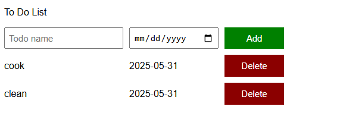

# 📝 To-Do List Project

A simple, interactive to-do list built using **vanilla JavaScript**. This app allows users to add tasks with due dates and delete them dynamically. No external libraries or frameworks are required.

 <!-- Optional: Add a screenshot of your app -->

---

## 🚀 Features

- ✅ Add new tasks with a name and due date  
- 🗑️ Delete tasks from the list  
- 🔁 Task list updates automatically on changes  
- ⚡ Lightweight and fast — pure JavaScript

---


## 🧠 How It Works

- All tasks are stored in a JavaScript array (`todoList`).
- The `renderTodoList()` function dynamically displays the task list and sets up delete functionality.
- The `addTodo()` function grabs input values, adds a new task to the list, and refreshes the view.

---

## 🏗️ File Structure

📁 your-project-folder/
├── index.html # HTML structure
├── script.js # JavaScript logic
└── style.css # (Optional) CSS styling

---

## 🛠️ Setup Instructions

1. Clone the repository:
   ```bash
   git clone https://github.com/your-username/your-repo-name.git

   Open index.html in a web browser.

Start adding and managing your tasks!

🧪 Sample HTML
Here's a minimal setup for the script to work properly:
```html
<input placeholder="Task name" class="js-name-input" />
<input type="date" class="js-due-date-input" />
<button class="js-add-todo-button">Add</button>

<div class="js-todo-list"></div>

<script src="script.js"></script>
```
🗃️ Example Tasks
```js
const todoList = [
  { name: "cook", dueDate: "2025-05-31" },
  { name: "clean", dueDate: "2025-05-31" },
];
```
## ✅ Simple To-Do List App Full Logic (JavaScript)

This is a lightweight to-do list app where users can add tasks with due dates and delete them as needed. The task list is rendered dynamically using JavaScript.

```javascript
// Initial list of tasks
const todoList = [
  { name: "cook", dueDate: "2025-05-31" },
  { name: "clean", dueDate: "2025-05-31" },
];

// Render the to-do list on page load
renderTodoList();

function renderTodoList() {
  let todoListHTML = "";

  // Loop through tasks and generate HTML
  todoList.forEach((todoObject, index) => {
    const { name, dueDate } = todoObject;
    const html = `
      <div>${name}</div>
      <div>${dueDate}</div> 
      <button class="delete-todo-button js-delete-todo-button">Delete</button>   
    `;
    todoListHTML += html;
  });

  // Display all tasks in the container
  document.querySelector(".js-todo-list").innerHTML = todoListHTML;

  // Add click event listeners to each delete button
  document.querySelectorAll('.js-delete-todo-button')
    .forEach((deleteButton, index) => {
      deleteButton.addEventListener('click', () => {
        todoList.splice(index, 1);  // Remove item from the list
        renderTodoList();           // Re-render updated list
      });
    });
}

// Handle "Add" button click
document.querySelector('.js-add-todo-button').addEventListener('click', () => {
  addTodo();
});

function addTodo() {
  const inputElement = document.querySelector(".js-name-input");
  const name = inputElement.value;

  const dateInputElement = document.querySelector(".js-due-date-input");
  const dueDate = dateInputElement.value;

  // Add the new task to the array
  todoList.push({ name, dueDate });

  // Clear input field
  inputElement.value = "";

  // Update the task list
  renderTodoList();
}
```
🚧 Future Enhancements
Save tasks in localStorage
```
- Edit existing tasks

- Sort tasks by due date

- Style UI with modern CSS or frameworks
```
🤝 Contributing
```
Pull requests are welcome! For major changes, please open an issue first to discuss what you'd like to change.
```
🙌 Acknowledgments
```
Thanks for checking out this project! Built for learning and fun.
```
 ## 👤 Author
 Ellias Sithole
